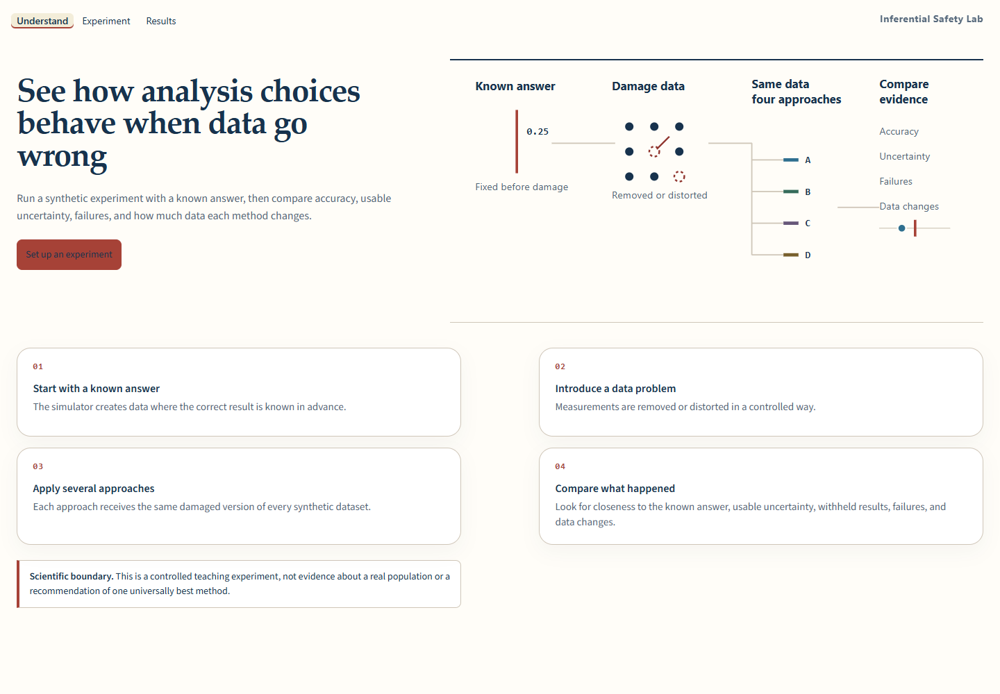
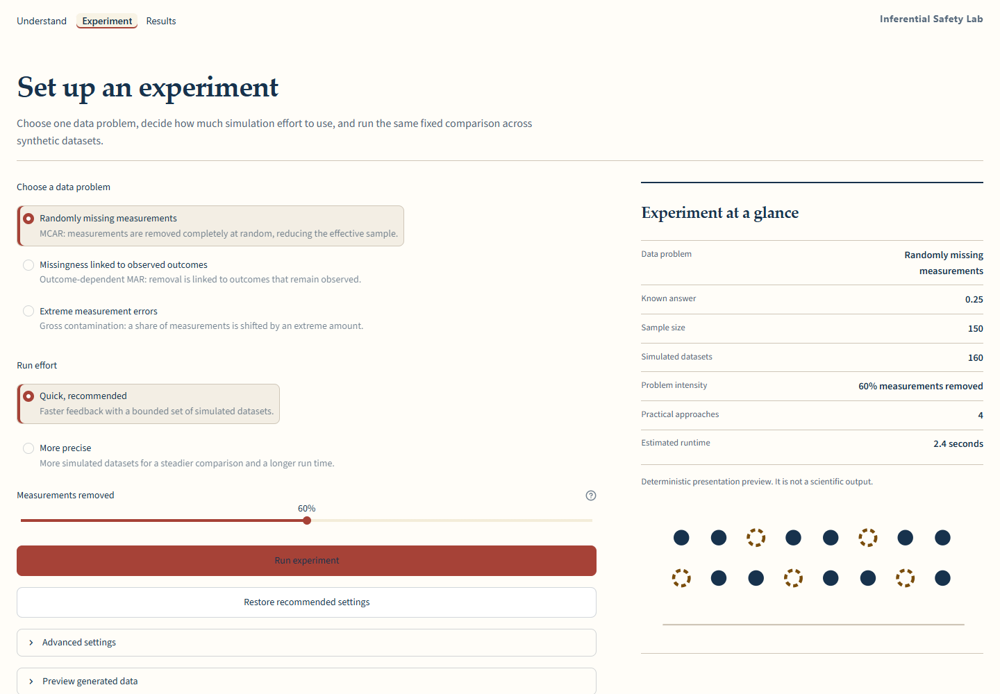
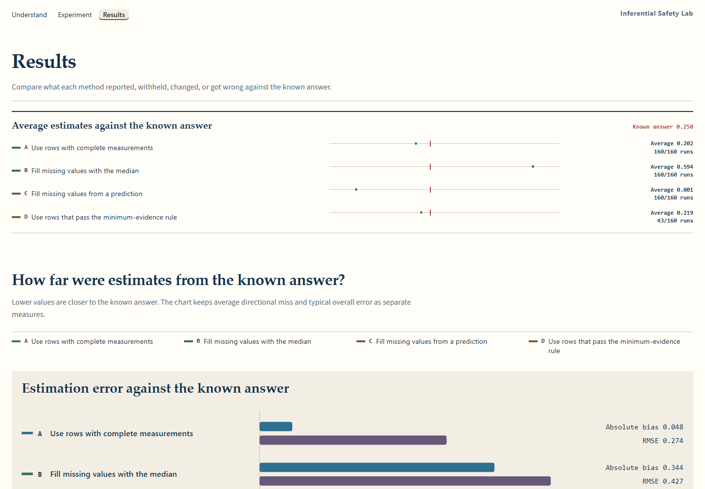
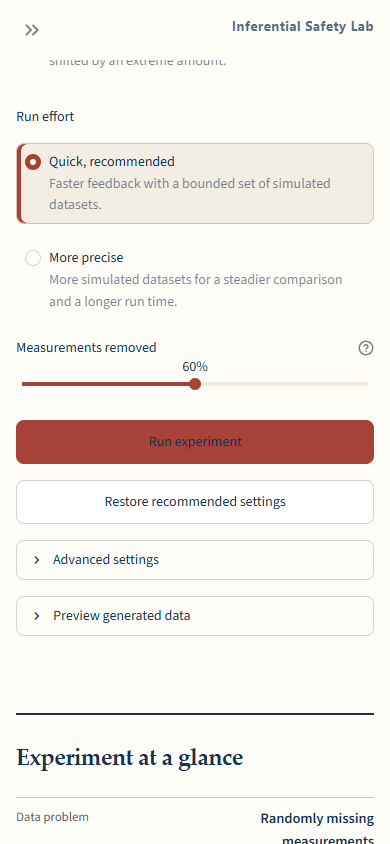
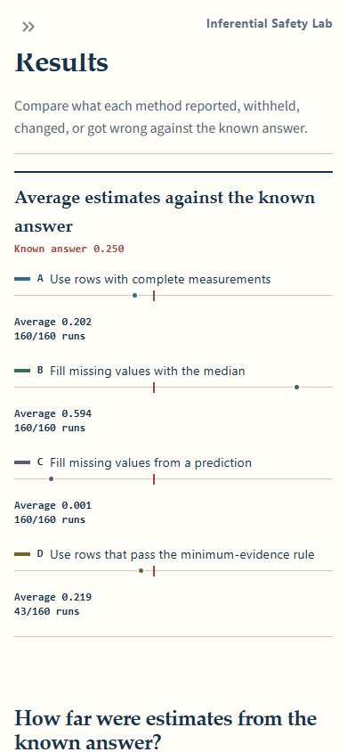
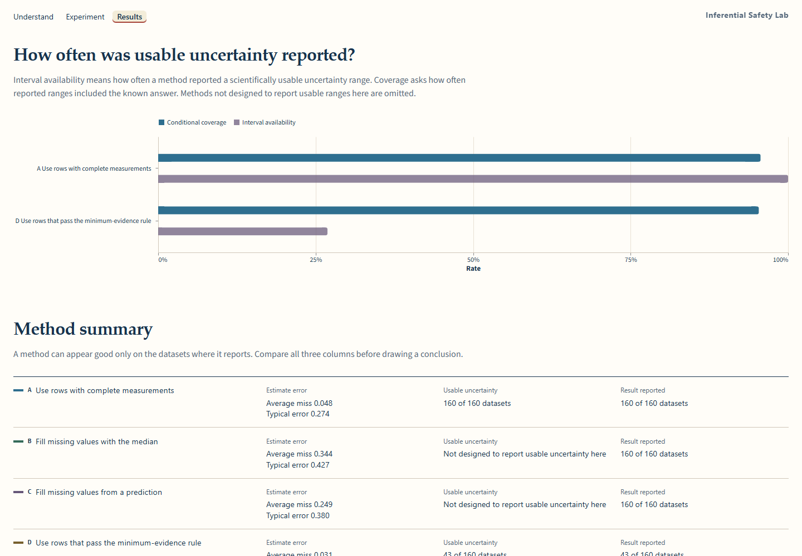
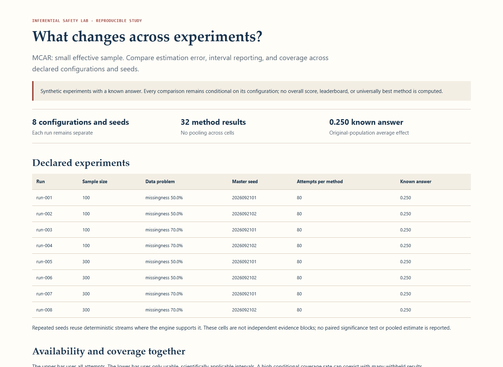
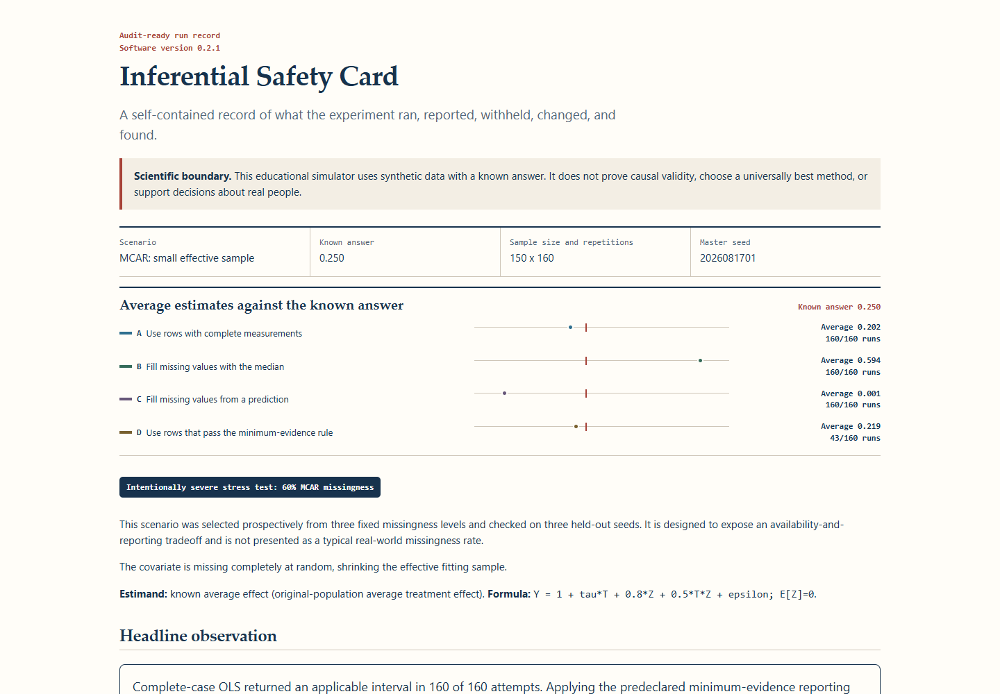

# Inferential Safety Lab

See how analysis choices behave when data go wrong.

[](https://github.com/aldaqrouqtaysir/inferential-safety-lab/actions/workflows/ci.yml?query=branch%3Amain)

[**Open the verified Live Demo**](https://inferential-safety-lab.streamlit.app/)

Inferential Safety Lab creates synthetic data where the correct answer is known,
removes or distorts some measurements, applies a fixed set of analysis
approaches, and compares:

- how close each approach came to the known answer;
- how often it reported usable uncertainty;
- whether it reported, withheld, or failed;
- and how much data it changed or removed.

> **Scientific boundary:** This educational simulator uses synthetic data with a
> known answer. It does not prove causal validity, choose a universally best
> method, or support decisions about real people.



Version 0.2.1 is the first public release. The source repository is
[github.com/aldaqrouqtaysir/inferential-safety-lab](https://github.com/aldaqrouqtaysir/inferential-safety-lab).
The public application is deployed from `main` on Streamlit Community Cloud.

## Live demo

Run the verified public application at
[inferential-safety-lab.streamlit.app](https://inferential-safety-lab.streamlit.app/).

## Product flow

The Streamlit application has three top-level pages:

1. **Understand** explains the experiment with a concrete worked example.
2. **Experiment** exposes the data problem, run effort, scenario intensity,
   Run action, and a structured at-a-glance rail with a deterministic scenario
   preview. Scientific controls remain available in Advanced settings.
3. **Results** keeps the last completed result immutable while settings are
   edited, anchors average estimates to the known answer, presents the primary
   comparison in plain language, and places exact formulas, denominators,
   contracts, replay data, and canonical JSON in a technical disclosure.









## One worked result

The frozen demonstration uses randomly missing measurements, 150 rows, a known
answer of 0.25, 160 simulated datasets, master seed `2026081701`, and an
intentionally severe 60% missingness rate. That rate was selected prospectively
from three fixed candidates and checked on three held-out seeds. It is designed
to make the reporting tradeoff visible, not to represent a typical real-world
missingness rate.

The complete-case approach reported usable uncertainty for all 160 simulated
datasets. Applying the predeclared minimum-evidence rule withheld 117 results.
Among the 43 reported ranges, 41 contained the known answer.

This does not identify a winner. Error for a method that withholds results is
conditional on the datasets where it reported, so accuracy and availability
must be read together.



## Features

- deterministic synthetic data with evaluator-owned truth;
- exactly three bounded scenario presets;
- exactly four fixed, relevant method pipelines per scenario;
- distinct fit, point, interval-applicability, and interval-availability states;
- typed failures retained in every denominator;
- explicit row-retention, filling, changed-value, and deletion burdens;
- immutable saved results with stale-draft warnings;
- one intentionally light, keyboard-accessible responsive interface;
- replay-stable canonical JSON and a print-ready audit-ready Safety Card;
- bounded CLI studies comparing declared configurations and seeds with separate
  cell results and offline reports;
- no uploads, external data, accounts, storage, telemetry, or runtime network
  path.

## Quick start

Python 3.12 is primary; Python 3.13 is also supported.

```powershell
py -3.12 -m venv .venv
.\.venv\Scripts\python.exe -m pip install -e .
.\.venv\Scripts\python.exe -m streamlit run streamlit_app.py
```

Run the frozen demonstration from the CLI:

```powershell
.\.venv\Scripts\inferential-safety.exe validate-config --config configs/demo_mcar_stress.json
.\.venv\Scripts\inferential-safety.exe demo --output artifacts/demo
.\.venv\Scripts\inferential-safety.exe run --config configs/gross_contamination.json --output artifacts/contamination
```

The normal installation uses only NumPy, pandas, and Streamlit. Development
tools are isolated in the `dev` extra.

## Batch experiment comparisons

Declare a grid of sample sizes, scenario intensities, and explicit seeds, then
compare the existing methods in an offline report. Studies validate every cell
before simulation and allow at most 32 cells. Choose a new output directory:

```powershell
.\.venv\Scripts\inferential-safety.exe validate-study --config configs/studies/mcar-sensitivity.json
.\.venv\Scripts\inferential-safety.exe study --config configs/studies/mcar-sensitivity.json --output artifacts/mcar-sensitivity
```

The example specifies 8 cells, 640 simulated datasets, and 32 method rows.
Results stay separate across configurations and seeds, with no pooled score or
method ranking. See [studies.md](docs/studies.md) for the configuration format,
scientific interpretation, saved artifacts, and replay commands.



Offline report for the 8-cell MCAR example; each configuration and seed remains separate.

## Scenarios

- **Randomly missing measurements** (`MCAR_SMALL_EFFECTIVE_SAMPLE`): covariate
  values are removed independently at a fixed rate.
- **Missingness linked to observed outcomes** (`OUTCOME_DEPENDENT_MAR`): a
  calibrated logistic law links missingness to observed treatment and outcome.
- **Extreme measurement errors** (`GROSS_CONTAMINATION`): a bounded share of
  observed covariates receives a signed fixed displacement.

The clean-data run is evaluator-only and is never selectable. See
[scenarios.md](docs/scenarios.md) and [scenario-freeze.md](docs/scenario-freeze.md).

## Methods and metrics

Missingness scenarios compare complete-case OLS with HC3, median single
imputation, deterministic regression single imputation, and complete-case OLS
with a minimum-evidence reporting guard. The guarded method uses the same rows,
design, outcome, estimate, covariance, and interval as ordinary complete-case
OLS whenever the rule passes. Only its reporting contract differs.

The contamination scenario compares no repair, fixed winsorization, guarded row
deletion, and portable Huber point estimation. Deterministic imputation and
Huber intervals are scientifically inapplicable because their uncertainty is
not propagated by this bounded product.

Every technical rate exposes its numerator and denominator. Conditional
coverage is covered usable applicable intervals divided by usable applicable
intervals. Interval availability is usable applicable intervals divided by all
attempts. Valid-and-cover is covered usable applicable intervals divided by all
attempts. See [methods.md](docs/methods.md) and
[metrics-and-denominators.md](docs/metrics-and-denominators.md).

## Reproducibility and privacy

Runs use NumPy `PCG64`, domain-separated SHA-256 seed derivation, versioned
configuration and result schemas, canonical JSON, dependency identities, and a
replay hash. Two fresh processes produce byte-identical aggregate JSON and the
same raw replay hash when platform, architecture, Python version, NumPy build,
dependency environment, configuration, and seed are the same. Raw hashes are
environment-specific; they are not a claim of byte identity across operating
systems or numerical-library builds.

Across the supported Windows/Python 3.12 and Ubuntu/Python 3.12–3.13 matrix,
scientific structure and all counts, identifiers, states, denominators, and
displayed conclusions must match exactly. Finite scientific floats are compared
to the checked-in reference with `rtol = 1e-12` and `atol = 1e-12`. Platform
floating-point libraries can produce smaller low-order differences. Timing is
written separately because scheduling is not scientifically reproducible.
Runtime diagnostics do not contain an absolute Python executable path.

Only aggregate synthetic results leave the engine. The UI contains no upload,
URL input, or external-data widget, and simulation requires no network after
installation. See [reproducibility.md](docs/reproducibility.md) and
[public provenance](docs/public-provenance.md).

## Testing

Install the development extra, then run:

```powershell
.\.venv\Scripts\python.exe -m pip install -e ".[dev]"
.\.venv\Scripts\python.exe -m pytest --cov --cov-report=term-missing
$env:ISL_RUN_BROWSER_TESTS="1"
.\.venv\Scripts\python.exe -m pytest tests/browser/test_v020_app.py
.\.venv\Scripts\python.exe -m ruff check .
.\.venv\Scripts\python.exe -m ruff format --check .
.\.venv\Scripts\python.exe -m mypy src/inferential_safety_lab
.\.venv\Scripts\python.exe -m build
```

The Playwright matrix covers navigation, first-viewport CTA and comparison
visibility, deterministic visuals, desktop and mobile Experiment composition,
empty and successful Results states, stale-result prevention, progress
announcements, focus visibility, target size, heading order and clipping,
contrast tokens, reduced motion, console errors, light and dark OS preferences,
1440x1000, 1366x768, 1024x768, 390x844, and a 125% zoom-equivalent layout.
Every CI matrix job independently tests exact fresh-process replay; the frozen
reference test separately enforces typed cross-platform scientific equivalence.



## Limitations

- Conclusions apply only to the selected synthetic mechanism and configuration.
- Complete-case estimates can describe a selected-data projection.
- Deterministic single imputation does not propagate uncertainty.
- Huber regression does not generally correct covariate measurement error or
  establish causal validity.
- Version 0.2.1 is not a publication-grade final experiment, decision engine,
  universal method recommender, or method leaderboard.

See [scientific-boundaries.md](docs/scientific-boundaries.md).

## Licence and citation

Original project code is released under the [BSD 3-Clause License](LICENSE).
Dependency notices are in [THIRD_PARTY_NOTICES.md](THIRD_PARTY_NOTICES.md).
Citation metadata is in [CITATION.cff](CITATION.cff).
