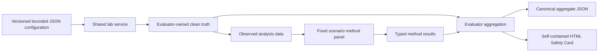
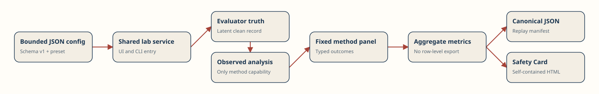

# Architecture

Inferential Safety Lab is one bounded Python application with two entry points:
the one-page Streamlit UI and the `inferential-safety` CLI. Both call
`services.run_lab`, which delegates to the same deterministic engine.

## Capability boundary

`EvaluatorTruth` owns latent `Z`, potential outcomes, the corruption masks, and
the known target. `ObservedData` contains only row identity, treatment,
outcome, and the current observed covariate. Practical method modules receive
only `ObservedData`. Structural tests reject imports from evaluator DGP or
metric modules into method modules; runtime tests confirm the observed record
does not expose truth fields and its buffers cannot be made writable.

## Execution flow

Each repetition derives independent DGP and corruption seeds from the master
seed, scenario, and repetition number. The clean evaluator reference and all
four practical methods operate on the same generated repetition. Method
results retain classified failures and intervention counts. Aggregation then
discards all row-level arrays.

## Reporting boundary

The canonical JSON contains configuration, environment identity, method
contracts, aggregate metrics, chart-ready aggregate values, the clean-data
reference summary, and replay material. It contains no preview rows or
row-level data. The Safety Card is rendered entirely from this aggregate.

Environment identity and the raw replay hash participate in exact-environment
replay but are excluded from the typed cross-platform scientific comparison.
Timing remains outside the canonical aggregate. All remaining scientific paths
are compared with exact typed states and bounded finite floats as documented in
[reproducibility.md](reproducibility.md).
